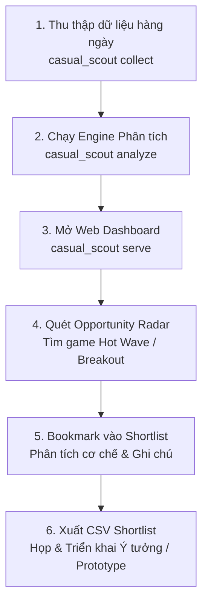

# ASOL Market Research — Casual Scout

[](https://www.python.org/)
[](https://fastapi.tiangolo.com/)
[](https://www.sqlite.org/)

**Casual Scout** là công cụ nghiên cứu thị trường game casual trên thiết bị di động. Ứng dụng thu thập bảng xếp hạng và metadata từ Apple App Store, theo dõi biến động thứ hạng, phân loại game, tổng hợp tín hiệu thị trường và hỗ trợ chọn ứng viên để nghiên cứu sâu hơn. Google Play dùng HTTP cho cùng chín thị trường, hỗ trợ Top Free và Top Grossing.

Ứng dụng chạy cục bộ bằng Python, FastAPI và SQLite. Giao diện web phục vụ việc xem dữ liệu, theo dõi lượt thu thập và quản lý shortlist. Điểm cơ hội và gợi ý AI là tín hiệu hỗ trợ phân tích, không phải dự báo doanh thu hay quyết định tự động.

---

## 📑 Mục Lục
1. [Tính Năng Nổi Bật](#-tính-năng-nổi-bật)
2. [Cài Đặt & Khởi Động Nhanh](#-cài-đặt--khởi-động-nhanh)
3. [Tổng Hợp Toàn Bộ Lệnh CLI](#-tổng-hợp-toàn-bộ-lệnh-cli)
   - [1. Khởi tạo & Vận hành Core](#1-khởi-tạo--vận-hành-core)
   - [2. Phân Tích & Xu Hướng (Phase 2)](#2-phân-tích--xu-hướng-phase-2)
   - [3. Thống Kê & Opportunity Radar (Phase 3)](#3-thống-kê--opportunity-radar-phase-3)
   - [4. Quản Lý Shortlist Game Tiềm Năng](#4-quản-lý-shortlist-game-tiềm-năng)
   - [5. Khảo Sát Tự Động & Sao Lưu (Operations)](#5-khảo-sát-tự-động--sao-lưu-operations)
4. [Giao Diện Web (Localhost Dashboard)](#-giao-diện-web-localhost-dashboard)
5. [Quy Trình Nghiên Cứu Đề Xuất](#-quy-trình-nghiên-cứu-đề-xuất)
6. [Cấu Trúc Thư Mục Dữ Liệu](#-cấu-trúc-thư-mục-dữ-liệu)
7. [Android HTTP](#android--http-crawl-và-phân-tích-đa-thị-trường)
8. [Gemini pilot](#gemini-free-tier-pilot-manual-ai-evaluation)

---

## 🌟 Tính Năng Nổi Bật

* **9 thị trường iOS mặc định:** `vn` (Việt Nam), `th` (Thái Lan), `id` (Indonesia), `my` (Malaysia), `ph` (Philippines), `sg` (Singapore), `la` (Lào), `kh` (Campuchia) và `us` (Hoa Kỳ). CLI cho phép chọn phạm vi khác bằng `--countries`.
* **Taxonomy Engine (P2):** Tự động phân loại 8 thể loại phụ (`Puzzle`, `Hypercasual`, `Simulation`, `Arcade`, `Action`, `Card/Board`, `Sports/Racing`, `Casual`) và nhận diện 9 cơ chế gameplay cốt lõi (`Match-3`, `Merge`, `Sort/Packing`, `Idle/Tycoon`, `Runner`, `Card/Board`, `Word/Trivia`, `Drawing/Physics`, `Unknown`) kèm trích xuất bằng chứng từ metadata.
* **Market Signals (P2):** Phát hiện tức thì các hiện tượng thị trường:
  * 🚀 `FAST_RISER`: Tăng $\ge 20$ bậc trong 24h hoặc $\ge 30$ bậc trong 3 ngày.
  * 🌟 `NEW_ENTRY`: Game mới lần đầu xuất hiện trong Top 100.
  * 📉 `FALLING`: Tụt hạng sâu.
  * ⚓ `STEADY`: Giữ vững phong độ trong Top.
* **Opportunity Radar v1 (P3):** Chấm điểm cơ hội giải trình minh bạch (Explainable Score 0-100đ):
  $$\text{Score} = \text{Momentum (40đ)} + \text{Market Breadth (35đ)} + \text{Rank Tier (25đ)}$$
  Phân tầng cơ hội: `🔥 Hot Wave` ($\ge 75$), `⚡ Breakout` ($55-74$), `💎 Regional Gem` ($35-54$), `👀 Monitoring` ($< 35$).
* **Ma Trận Nhiệt Thị Trường (Heatmap):** Trực quan hóa phân bố subgenre giữa các thị trường có dữ liệu.
* **Shortlist & Export (P3):** Bookmark game vào danh sách xem xét, phân loại ưu tiên (`HIGH`, `MEDIUM`, `LOW`), gắn nhãn và xuất CSV chuẩn `utf-8-sig` (hỗ trợ mở bằng Microsoft Excel với nội dung tiếng Việt).
* **Lưu trữ và truy xuất bằng chứng:** SQLite ở chế độ WAL và raw store định danh nội dung bằng SHA-256 hỗ trợ kiểm tra lại dữ liệu nguồn.

---

## 🚀 Cài Đặt & Khởi Động Nhanh

### 1. Môi trường yêu cầu
* Python 3.12 trở lên.
* Hệ điều hành: Windows, macOS hoặc Linux.

### 2. Cài đặt môi trường ảo
```powershell
# Tạo môi trường ảo
python -m venv .venv

# Kích hoạt môi trường (Windows PowerShell)
.\.venv\Scripts\Activate.ps1

# Cài đặt dependencies và package ở chế độ development
pip install -r requirements.lock.txt
pip install -e .
```

### 3. Khởi tạo Database
```powershell
casual_scout init --data-dir .\data
```

### 4. Thu thập dữ liệu mẫu
```powershell
# Thu thập Top 100 thị trường Việt Nam & Mỹ kèm metadata
casual_scout collect --markets vn,us --data-dir .\data

# Hoặc thu thập 9 thị trường mặc định
casual_scout collect --data-dir .\data
```

### 5. Chạy phân tích ngày
```powershell
casual_scout analyze --data-dir .\data
```

### 6. Khởi động Web Dashboard
```powershell
casual_scout serve --host 127.0.0.1 --port 8000 --data-dir .\data
```
Truy cập [http://127.0.0.1:8000](http://127.0.0.1:8000) trên trình duyệt.

Trên `/dashboard` và `/data`, **Crawl ngay** thu thập Top Free Casual iOS của **9 thị trường**: Việt Nam, Thái Lan, Indonesia, Malaysia, Philippines, Singapore, Lào, Campuchia và Mỹ. Nút crawl, lịch hằng ngày và lịch một lần trên `/data` dùng cùng nhóm này, không phụ thuộc bộ lọc xem dữ liệu. Sau crawl, hệ thống phân tích các thị trường có bản chụp hoàn chỉnh theo đúng ngày quan sát UTC; lỗi nguồn ở một nước vẫn được ghi rõ trong lượt chạy. Lịch 07:00 `Asia/Ho_Chi_Minh` tắt mặc định; bật bằng công tắc trên Dashboard. Lịch chỉ chạy khi lệnh `serve` và máy vẫn đang hoạt động, không chạy bù khi server tắt. Lịch đã bật/đặt trước sẽ dùng nhóm mới sau khi khởi động lại web; không tự bật lịch đang tắt. Android dùng cùng chín thị trường, cả Top Free và Top Grossing, với lịch riêng.

---

## 💻 Tổng Hợp Toàn Bộ Lệnh CLI

Quy trình cơ bản: **khởi tạo → thu thập → phân tích → xem dashboard/radar → chọn game vào shortlist**. Có thể chạy khảo sát theo lịch và sao lưu dữ liệu như các bước vận hành độc lập.


Cú pháp chung:
```bash
casual_scout <command> [subcommand] [options]
```

---

### 1. Khởi tạo & Vận hành Core

#### `casual_scout init`
Khởi tạo cơ sở dữ liệu SQLite và thư mục lưu trữ raw payload.
```powershell
casual_scout init [--data-dir <path>]
```
* `--data-dir`: Thư mục chứa dữ liệu (mặc định: `./data`).

#### `casual_scout collect`
Kích hoạt tiến trình thu thập Top 100 bảng xếp hạng Apple RSS và làm giàu metadata qua iTunes Lookup API một cách đồng bộ.
```powershell
casual_scout collect [--countries vn,us,th] [--no-enrich] [--data-dir <path>]
```
* `--countries` / `--markets`: Danh sách mã quốc gia cách nhau bằng dấu phẩy (mặc định: `vn,th,id,my,ph,sg,la,kh,us`).
* `--no-enrich`: Chỉ cào bảng xếp hạng RSS, bỏ qua bước gọi iTunes Lookup để lấy mô tả/đánh giá (giúp cào cực nhanh).

#### `casual_scout serve`
Khởi chạy máy chủ Web FastAPI Dashboard cục bộ. Tự động kiểm tra và áp dụng migration database.
```powershell
casual_scout serve [--host 127.0.0.1] [--port 8000] [--data-dir <path>]
```
* `--host`: Địa chỉ IP bind (mặc định: `127.0.0.1`).
* `--port`: Cổng lắng nghe (mặc định: `8000`).

#### `casual_scout work`
Dành cho worker chạy ngầm xử lý một `run_id` đã được đưa vào hàng đợi (`queued`).
```powershell
casual_scout work --run-id <run_uuid> [--no-enrich] [--data-dir <path>]
```

---

### 2. Phân Tích & Xu Hướng (Phase 2)

#### `casual_scout analyze`
Chạy engine phân tích delta thứ hạng (1 ngày, 3 ngày, 7 ngày), phân loại thể loại/cơ chế gameplay, tính toán độ phủ sóng liên thị trường và gắn nhãn tín hiệu (`FAST_RISER`, `NEW_ENTRY`, `FALLING`, `STEADY`).
```powershell
casual_scout analyze [--date YYYY-MM-DD] [--countries vn,us] [--data-dir <path>]
```
* `--date`: Ngày phân tích (định dạng UTC `YYYY-MM-DD`, mặc định: hôm nay).
* `--countries`: Giới hạn các thị trường cần phân tích (mặc định: toàn bộ).

#### `casual_scout trends`
Truy vấn bảng xếp hạng xu hướng, delta tăng giảm và tín hiệu của một thị trường cụ thể.
```powershell
casual_scout trends [--date YYYY-MM-DD] [--country vn] [--signal FAST_RISER] [--json] [--data-dir <path>]
```
* `--country`: Mã quốc gia (mặc định: `vn`).
* `--signal`: Bộ lọc tín hiệu: `FAST_RISER` (hoặc `fast_risers`), `NEW_ENTRY`, `FALLING`, `STEADY`.
* `--json`: Xuất dữ liệu thô dưới dạng JSON thay vì bảng Markdown.

---

### 3. Thống Kê & Opportunity Radar (Phase 3)

#### `casual_scout stats overview`
Hiển thị tổng quan thị trường: tổng số game theo dõi, số lượng Hot Waves, Fast Risers, thể loại thống trị và bảng phân bổ chi tiết tỷ lệ % Subgenres.
```powershell
casual_scout stats overview [--date YYYY-MM-DD] [--country all|vn|us] [--json] [--data-dir <path>]
```
* `--country`: Mã quốc gia hoặc `all` để xem toàn bộ dữ liệu hiện có.
* `--json`: Xuất kết quả dạng JSON.

#### `casual_scout stats radar`
Chạy thuật toán Opportunity Radar để tìm kiếm các game tiềm năng nhất, sắp xếp theo Điểm Cơ Hội giảm dần.
```powershell
casual_scout stats radar [--date YYYY-MM-DD] [--country all|vn] [--limit 20] [--json] [--data-dir <path>]
```
* `--limit`: Số lượng game cơ hội hiển thị (mặc định: `20`).
* `--country`: Thị trường mục tiêu hoặc `all`.

---

### 4. Quản Lý Shortlist Game Tiềm Năng

#### `casual_scout shortlist add`
Thêm hoặc cập nhật một game vào danh sách theo dõi (Shortlist).
```powershell
casual_scout shortlist add <app_id> --title "Tên Game" [--country vn] [--rank 10] [--subgenre "Puzzle"] [--mechanic "Match-3"] [--priority HIGH|MEDIUM|LOW] [--notes "Ghi chú phân tích"] [--data-dir <path>]
```
* `<app_id>`: Apple Track ID (ví dụ: `1582218735`).
* `--title`: Tên game.
* `--priority`: Mức độ ưu tiên (`HIGH`, `MEDIUM`, `LOW`).
* `--notes`: Ghi chú định hướng hoặc phân tích lối chơi.

#### `casual_scout shortlist list`
Liệt kê danh sách các game đã bookmark trong Shortlist.
```powershell
casual_scout shortlist list [--status CONSIDERING|PROTOTYPE|PASSED] [--priority HIGH|MEDIUM|LOW] [--json] [--data-dir <path>]
```
* `--status`: Lọc theo trạng thái (`CONSIDERING`: Đang xem xét, `PROTOTYPE`: Lên mẫu thử, `PASSED`: Đã duyệt/Bỏ qua).
* `--priority`: Lọc theo độ ưu tiên.

---

### 5. Khảo Sát Tự Động & Sao Lưu (Operations)

#### `casual_scout survey`
Thực thi khảo sát tự động theo 4 khung giờ vàng UTC (`00:00`, `06:00`, `12:00`, `18:00 UTC` tương ứng `07:00`, `13:00`, `19:00`, `01:00 UTC+7`). Được dùng trong Windows Task Scheduler / Cron job.
```powershell
casual_scout survey [--data-dir <path>]
```

#### `casual_scout survey-report`
Xuất báo cáo đánh giá độ ổn định của lịch chạy khảo sát, tỷ lệ slot bị lỡ (missed), số lượt lỗi và độ trễ phản hồi (latency P50/P95).
```powershell
casual_scout survey-report [--days 7] [--data-dir <path>]
```

#### `casual_scout backup`
Tạo bản sao lưu an toàn toàn bộ cơ sở dữ liệu SQLite và thư mục raw payload với tệp `manifest.json` chứa mã băm kiểm tra tính toàn vẹn (checksum).
```powershell
casual_scout backup --destination D:\Backups\asol_research [--data-dir <path>]
```

#### `casual_scout restore`
Khôi phục dữ liệu từ bản sao lưu đã kiểm chứng toàn vẹn.
```powershell
casual_scout restore --manifest D:\Backups\asol_research\manifest.json --target-dir .\data-restored
```

---

## 🌐 Giao Diện Web (Localhost Dashboard)

Khi chạy `casual_scout serve`, bạn có thể truy cập các trang chuyên dụng:

1. **`/dashboard` (Tổng quan & Opportunity Radar)**:
   * **KPIs Cards**: Thống kê số lượng game Top, Hot Waves, Fast Risers và Shortlist.
   * **Bảng Opportunity Radar**: Xếp hạng cơ hội theo thuật toán P3, hiển thị điểm thành phần (Tăng trưởng, Độ phủ, Thứ hạng), huy hiệu cơ hội và nút Quick Add vào Shortlist.
   * **Ma trận nhiệt thị trường (Heatmap)**: Đối chiếu sự phổ biến của từng dòng game giữa các thị trường có dữ liệu.
   * **Biểu đồ phân bố Subgenres & Mechanics**: Biểu đồ trực quan xây dựng trên Chart.js.

2. **`/shortlist` (Quản lý ứng viên game)**:
   * Quản lý trạng thái thẩm định game (`CONSIDERING`, `PROTOTYPE`, `PASSED`).
   * Thay đổi mức độ ưu tiên, cập nhật ghi chú phân tích qua Modal.
   * Nút xuất dữ liệu ra file **CSV** (hỗ trợ tiếng Việt cho Excel) và **JSON**.

3. **`/data` hoặc `/` (Dữ liệu thị trường chi tiết)**:
   * Xem bảng xếp hạng Top 100 chi tiết theo từng quốc gia.
   * Lọc nhanh theo tín hiệu (`Fast Riser`, `New Entry`, `Falling`, `Steady`).
   * Lọc theo thể loại phụ (`Subgenre`) và cơ chế (`Mechanic`).
   * Tải về file CSV dữ liệu thị trường.

4. **`/games/{app_id}` (Chi tiết Game & Lịch sử Thứ hạng)**:
   * Biểu đồ biến động thứ hạng qua thời gian.
   * Phân tích cơ chế chơi, độ tin cậy và trích xuất bằng chứng từ mô tả/tên game.
   * Danh sách các thị trường game đang đồng thời có mặt trong Top 100.

5. **`/runs` (Nhật ký thu thập)**:
   * Theo dõi trạng thái các phiên cào dữ liệu, số game hợp lệ và thời gian kết thúc (chuẩn múi giờ Việt Nam UTC+7).

---

## 🔄 Quy Trình Nghiên Cứu Đề Xuất

Để có kết quả phân tích thị trường tốt nhất:



---

## 📂 Cấu Trúc Thư Mục Dữ Liệu

Mặc định thư mục dữ liệu `./data` sẽ chứa:
```text
data/
├── casual-scout.sqlite3       # Database SQLite chính (WAL mode, lưu trữ bảng xếp hạng, analytics, shortlists)
├── .session_secret            # Khóa bí mật ký phiên CSRF bảo mật cho Web UI
├── raw/                       # Raw Storage địa chỉ hóa theo mã băm SHA-256 của từng HTTP response
└── logs/                      # Log tiến trình và nhật ký lỗi
```

---

## 🧪 Chạy Kiểm Thử Tự Động (Test Suite)

Dự án có bộ kiểm thử tự động (unit, integration và acceptance):
```powershell
pytest -v
```
Số lượng và kết quả kiểm thử có thể thay đổi theo phiên bản; chạy lệnh trên để xem trạng thái hiện tại.

---

## Android — HTTP crawl và phân tích đa thị trường

Chọn Android trên `/data` hoặc `/dashboard?platform=android`. Nút **Crawl Android** lấy
Top Free và Top Grossing Casual ở VN, TH, ID, MY, PH, SG, LA, KH và US.
Chart dùng HTTP POST Google Play RPC; metadata dùng HTTP GET trang chi tiết, tối đa
10 request đồng thời. Không cần Chrome, ChromeDriver hoặc Selenium.

```powershell
.\.venv\Scripts\python.exe -m pip install -e .
.\.venv\Scripts\python.exe -m casual_scout collect --platform android --chart-type all --data-dir .\data
.\.venv\Scripts\python.exe -m casual_scout analyze --platform android --data-dir .\data
.\.venv\Scripts\python.exe -m casual_scout stats radar --platform android --data-dir .\data
.\.venv\Scripts\python.exe -m casual_scout.cli serve --host 127.0.0.1 --port 8000 --data-dir .\data
```

`collect --platform all` chạy iOS trước, Android sau. iOS vẫn là mặc định.
`--markets vn,us` giới hạn thị trường; `--chart-type top-free` hoặc `top-grossing`
giới hạn feed. Dashboard, API và CLI dùng chung core database và worker HTTP.

- Lịch Android 07:00 giờ Việt Nam mặc định tắt; bật trên dashboard Android hoặc `/android`.
  Server phải chạy và collector phải rảnh trong phút 07:00; Android không chạy bù
  sau khi iOS kết thúc muộn. Lịch iOS một lần vẫn hoạt động.
- Dữ liệu đã xử lý giữ nguyên khi một game lỗi hoặc worker gián đoạn. Bấm crawl
  lại để tạo lượt mới; metadata hoàn chỉnh được tái dùng dưới 48 giờ theo đúng quốc gia.
- Thứ hạng lấy mới mỗi run; số lượng game là số thực thu, không cam kết Top 100.
  Developer là tên niêm yết. Top Grossing không phải số tiền doanh thu.
- Chart dưới 100 game được ghi `partial`; các thứ hạng quan sát được vẫn tham gia phân tích,
  không suy diễn game mới từ phần chart chưa quan sát. Google có thể trả Grossing dưới 100.
- Android hỗ trợ radar v1.5, installs badges và lịch sử Free/Grossing 14 ngày. Shortlist
  và AI hiện chỉ hỗ trợ iOS. `/android` giữ lịch sử legacy; crawl mới đi qua core HTTP.
- HTTP raw evidence lưu trong `data/raw/`; run và lỗi từng chart xem tại `/runs`.
- Các script browser probe/UI cũ chỉ là công cụ nghiên cứu lịch sử tùy chọn, cần
  `scripts/requirements-google-play-probe.txt` riêng; runtime HTTP không sử dụng chúng.

Để thử qua Wi-Fi, cấu hình đúng IP máy tính (ví dụ dưới đây); Windows Firewall
cần cho phép cổng sử dụng trên mạng nội bộ:

```powershell
$env:CASUAL_SCOUT_LAN_HOSTS = '192.168.1.4'
.\.venv\Scripts\python.exe -m casual_scout.cli serve --host 0.0.0.0 --port 8002 --data-dir .\data
```

Đánh giá triển khai: [Android HTTP acceptance](docs/operations/2026-09-29-android-plan-completion.md).

## Gemini Free Tier pilot (manual AI evaluation)

Set these server-side values in the ignored local `.env` or process environment. Process
environment values take precedence. Keep the real API key out of source control and logs.

```dotenv
GEMINI_API_KEY=replace-with-your-own-key
CASUAL_SCOUT_AI_ENABLED=true
CASUAL_SCOUT_AI_COST_MODE=free_tier
CASUAL_SCOUT_AI_FREE_TIER_CONFIRMED=true
CASUAL_SCOUT_AI_CONFIRM_UNKNOWN_COST=true
CASUAL_SCOUT_AI_MAX_OUTPUT_TOKENS=2000
CASUAL_SCOUT_AI_MAX_RUNS_PER_DAY=5
CASUAL_SCOUT_AI_TIMEOUT_SECONDS=60
```

The pilot uses `gemini-2.5-flash` and requires manual confirmation for each evaluation.
It reserves at most five attempted calls per Asia/Ho_Chi_Minh calendar day in SQLite;
failed and queued attempts count, and a server restart does not reset the limit. It sends
selected public store evidence to the Gemini Developer API. It does not send private
shortlist notes or local files. The application cannot verify your account's billing tier
or guarantee zero charges. Token usage is not an invoice, so actual cost remains unknown.
AI recommendations are a pilot result requiring human quality review before decisions.

Start the web server with `python -m casual_scout.cli serve` so the CLI explicitly loads
this configuration. On the iOS Dashboard, choose the analysis date/market and click
**Tạo gợi ý AI**. Inspect the preflight scope and limits, check the consent box, then
confirm. Opening or cancelling this dialog does not dispatch a model call. Review saved
runs at `/recommendations`; queued/running detail pages poll status with GET only.
If submission loses its connection, inspect history before creating another run.
Direct `create_app(...)` remains disabled unless AI settings/provider are explicitly injected.

Offline verification: [P4 acceptance and remaining gates](docs/superpowers/reviews/p4-ui-verification.md).
Client behavior tests run with `node --test tests/js/test_ai_clients.cjs`; the Python
suite also executes the detail polling tests using Node. No live Gemini call is needed.

## Bản quyền

Phát triển cho mục đích nghiên cứu và phân tích thị trường casual games tại ASOL. Chưa có tệp giấy phép trong repository; cần xác nhận điều khoản trước khi phân phối ra ngoài.
