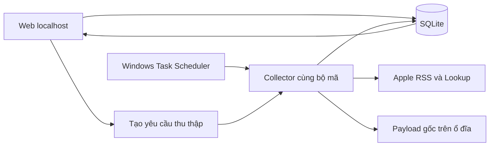

# Thiết kế P1 — Thu thập iOS và web cá nhân trên Windows

Ngày: 2026-09-10. ADR: `ADR-P1-001`. Trạng thái: **Thiết kế đã được người dùng duyệt: phương án A (Python + FastAPI + SQLite), xác nhận “ok phương án 1” ngày 2026-09-10; chuyển sang lập kế hoạch P1**.

Nguồn: [PRD v2.2](../../prd/2026-09-10-casual-game-market-research-PRD.md), [kết quả kiểm chứng trực tiếp](../../core/research/2026-09-10-ios-p1-source-verification.md). Bối cảnh mới đã xác nhận: máy Windows hiện tại, dùng cá nhân trước. Workspace hiện chỉ có tài liệu, không có ứng dụng hoặc Git repository được phát hiện; chưa tạo repo hay cài dependency.

## 1. Phạm vi và tiến độ thiết kế

- [x] Đọc PRD và giữ các quyết định đã duyệt.
- [x] Xác định môi trường vận hành cá nhân Windows.
- [x] Kiểm chứng nguồn theo thị trường, loại chart và Lookup.
- [x] So sánh phương án, mô tả luồng dữ liệu/web/lỗi/kiểm chứng.
- [x] Viết bản đề xuất cụ thể để duyệt; rà soát phạm vi và tính nhất quán.
- [x] Người dùng duyệt thiết kế P1 và lựa chọn kiến trúc: phương án A.
- [x] Sau duyệt: đã lập [kế hoạch triển khai P1](../plans/2026-09-10-ios-p1-implementation.md) bằng writing-plans.

P1 đáp ứng BA-R01–04, BA-R09, BA-R12 và NFR về dữ liệu/chi phí/lỗi. Web chỉ hiển thị dữ liệu và hoạt động thu thập. Delta, NEW_ENTRY/FAST_RISER thuộc P2; biểu đồ và thống kê trend thuộc P3; AI gợi ý nguồn lực thuộc P4. Không triển khai Android, chat hoặc gửi thông báo trong P1.

## 2. So sánh phương án và đề xuất

| Phương án | Thành phần | Lợi ích | Chi phí vận hành và đánh đổi |
|---|---|---|---|
| **A — Đã chọn** | Python, FastAPI + Jinja HTML, SQLite, collector chạy bằng CLI, Windows Task Scheduler | Một ứng dụng nhỏ, database cục bộ, không cần frontend build riêng; Python thuận cho các bước xử lý dữ liệu sau | Cần môi trường Python; dùng template thay vì SPA; quản lý truy cập SQLite giữa web và collector |
| B | Node.js, web render server, SQLite, collector CLI, Task Scheduler | Một ngôn ngữ JavaScript; có thể tiếp cận hệ thư viện scraper | Thư viện vẫn cần xác minh taxonomy/endpoint; chưa có nhu cầu cụ thể khiến JS ưu thế hơn trong P1 |
| C | n8n + kho dữ liệu + web riêng | Dễ xem/chỉnh workflow bằng giao diện | Thêm runtime/dịch vụ, workflow và web phải đồng bộ trạng thái; lợi ích chưa bù chi phí với một người/một nguồn |

Chọn **A** vì phù hợp Windows cá nhân, giới hạn P1 nhỏ và có thể phát triển P2 trên cùng dữ liệu. Đây là đánh giá kiến trúc, không phải benchmark hiệu năng. Máy có Python và Node trong PATH; phiên bản dependency được giải quyết và khóa trong bước thiết lập môi trường của kế hoạch. [FastAPI hỗ trợ template](https://fastapi.tiangolo.com/advanced/templates/), [Python có sqlite3](https://docs.python.org/3.12/library/sqlite3.html), [Windows có Task Scheduler](https://learn.microsoft.com/en-us/windows/win32/taskschd/task-scheduler-start-page).

Không thêm Docker, Redis, PostgreSQL hoặc hệ thống hàng đợi bên ngoài. Hàng đợi ở đây là danh sách công việc có trạng thái trong SQLite, không thêm dịch vụ.

## 3. Nguồn và phạm vi chart

Đề xuất lấy trực tiếp RSS `https://itunes.apple.com/{country}/rss/topfreeapplications/limit=100/genre=7003/json`. Nguồn đã trả title Casual và 100 ID riêng biệt ở VN, US, BN, KH, ID, LA, MY, MM, PH, SG, TH. Độ sâu **100** là lựa chọn đề xuất dựa trên kết quả thật; không cam kết 200.

TL luôn xuất hiện trong danh sách thị trường, trạng thái “Chưa xác minh được nguồn”, kèm lần kiểm tra HTTP 400 của Games endpoint; không gọi lặp hằng ngày cho đến khi có nguồn được xác minh. Không gọi TL “0 game” và không đưa vào mẫu số thị trường thu thập thành công.

Chart identity gồm provider, platform, country, collection, source genre ID, depth và phiên bản cấu hình. Rank là vị trí trong feed Casual, không là rank Games tổng thể. Thay chart/depth tạo identity mới để P2 không so sai chuỗi.

Nguồn gắn Casual được hiển thị là **“Casual theo Apple”**. Metadata giữ nhãn subgenre nguồn như Puzzle; chưa tạo engine suy mechanic ở P1. Nếu metadata thiếu hoặc mâu thuẫn membership, giữ entry nguồn và đánh dấu cần kiểm tra, không tự tái phân loại. Nhãn do nguồn không đồng nghĩa kết luận AI.

## 4. Ranh giới thành phần và luồng dữ liệu

- **Apple provider:** nhận country/chart hoặc danh sách app ID; trả payload và HTTP metadata. Không ghi database, không phân tích trend. URL cố định theo cấu hình cho phép, không nhận URL tự do từ web.
- **Collector:** điều phối một lượt, validate, lưu snapshot, yêu cầu Lookup phần metadata cần bổ sung; dùng lại từ CLI và lệnh chạy của web.
- **Storage:** transaction ngắn cho SQLite, payload UTF-8 lưu kèm hash; đọc snapshot không cần gọi lại Apple. Bật WAL/busy timeout trong triển khai và kiểm tra thực tế đọc/ghi đồng thời.
- **Web:** render HTML phía server; đọc dữ liệu đã lưu. Nút chạy chỉ tạo job và khởi động collector ở chế độ nền không mở cửa sổ; không giữ HTTP request chờ cả pipeline.
- **Scheduler:** gọi cùng collector CLI. Cấu hình lịch khảo sát/production chỉ tạo khi bước tương ứng được triển khai và kiểm tra, chưa đăng ký tác vụ trong đợt thiết kế.

## 5. Biểu diễn dữ liệu và tính nhất quán

| Entity | Khóa và nội dung | Vòng đời |
|---|---|---|
| Market | country code, tên, nhóm ASEAN/US, trạng thái nguồn | Cấu hình gồm 12 thị trường mục tiêu; VN một lần |
| ChartDefinition | identity ở mục 3, endpoint, expected depth, version | Không sửa identity của lịch sử khi đổi chart |
| Run | run ID, trigger manual/survey/daily, start/end UTC, trạng thái và summary | queued → running → succeeded/partial/failed/interrupted |
| MarketRun | run + chart, trạng thái lấy chart/enrichment riêng, lỗi, số nhận/hợp lệ | Cho phép nước này lỗi nhưng các nước khác tiếp tục |
| Snapshot + Entry | snapshot ID; unique(snapshot, app ID), unique(snapshot, rank); observed time, source updated, app name/URL/icon/genre nguồn | Bất biến sau commit; mỗi market transaction riêng; retry cùng MarketRun không tạo bản sao snapshot |
| App | provider/platform/source app ID | Tên không là khóa; cùng ID nhiều nước không làm mất rank mỗi nước |
| AppMetadata | app ID + country + fetched time, giá trị/genre/mô tả/rating, trạng thái và tham chiếu raw | Giữ phiên bản; snapshot/run tham chiếu metadata đã dùng để xem lại không bị thay bằng bản mới |
| RawResponse | hash, path, endpoint, status, received UTC; liên kết run/snapshot/metadata | Ghi file tạm rồi rename; xác minh tồn tại trước commit tham chiếu |
| RequestObservation | run/market/endpoint, start UTC, elapsed, status/error, retry, bytes và source timestamp nếu có | Đầu vào khảo sát lịch; không chứa secret |

UTC lưu cho mọi thời điểm; web hiển thị giờ VN và chú thích múi giờ. `source_updated` giữ riêng, chưa coi là thời điểm game thay đổi rank. Không tạo snapshot giả cho ngày máy tắt. Tất cả lần thu thập hợp lệ được lưu; P2 sẽ chọn mốc so sánh nhất quán từ observed time. P1 không áp quy tắc daily delta.

P1 giữ lịch sử, chưa tự xóa theo retention chưa chốt. Web báo dung lượng. Một bản sao SQLite nhất quán và thư mục raw tạo thành bộ backup; không sao chép riêng file database đang ghi theo cách có thể thiếu WAL. Chính sách backup tự động là bước vận hành cần chọn khi triển khai; không tự upload dữ liệu lên dịch vụ ngoài.

## 6. Quy trình thu thập và lỗi

1. Nhận job, lấy khóa một collector cho toàn ứng dụng bằng thao tác database atomic. Hai lượt từ web/scheduler đến cùng lúc: lượt sau báo đang có run hoạt động, không gọi thêm Apple.
2. Lấy chart tuần tự từng nước; kiểm tra payload parse được, title/genre/quốc gia, ID không trùng, URL quốc gia, số lượng. Lưu response gốc cả khi schema sai nếu nhận được body.
3. Với chart đã xác minh depth100, đủ 100 bản ghi hợp lệ mới publish snapshot complete. Nếu ít hơn: giữ evidence và trạng thái partial để xem, không thay latest complete. Nếu nhiều hơn cũng báo thay đổi schema/phạm vi, không âm thầm cắt hoặc đổi depth.
4. Lấy metadata theo lô tối đa 20 ID cùng quốc gia; đã thử đủ 20/20 tại VN/US. Cache đề xuất 24 giờ theo app/country; TTL này là lựa chọn thiết kế, không là tần suất cập nhật chính thức của Apple. Không có metadata mới vẫn dùng bản cache với timestamp; không có cache thì unknown.
5. Metadata nối bằng ID, không bằng thứ tự hoặc tên. Lookup thiếu một ID chỉ đánh dấu ID đó; enrichment lỗi không hủy snapshot chart hợp lệ.
6. Ban đầu giãn tối thiểu 4 giây giữa các lần bắt đầu request tới Apple, một request tại một thời điểm. Đây là cấu hình thận trọng đề xuất, không quota RSS được chứng nhận. Timeout 20 giây, tổng tối đa 3 attempts cho timeout/429/5xx; exponential backoff và Retry-After được ưu tiên, có giới hạn để không chờ vô hạn. 400/404 không retry dồn.
7. Hoàn tất run với thống kê từng thị trường. Nếu tiến trình chết, khi collector khởi động kiểm tra khóa/process/heartbeat trước khi đánh dấu interrupted; không chiếm khóa của tiến trình còn hoạt động. Khởi động lại tạo lượt mới; snapshot đã commit giữ nguyên.

Phân biệt trên web: chart complete + metadata partial, chart partial, request failed, source unverified, chưa chạy và dữ liệu cũ. Lỗi hiện rõ lần lỗi và lần thành công gần nhất. Không tự fallback sang chart Games/Apps hay provider trả phí.

## 7. Web tối thiểu và truy cập

Chạy ở `127.0.0.1`, một người dùng trên máy, không publish LAN/Internet. Không cần hệ tài khoản trong phạm vi này. POST có bảo vệ CSRF và kiểm tra Origin/Host; escape văn bản nguồn, không render mô tả HTML thô. Chạy collector nền bằng executable/arguments cố định, không nội suy lệnh từ dữ liệu web.

Ba màn hình đề xuất:

1. **Dữ liệu:** chọn thị trường và snapshot, xem bảng rank/tên/icon/genre nguồn/nhà phát triển, mở store URL. Ghi rõ chart Casual theo Apple, thời điểm quan sát, dữ liệu đủ/thiếu và “không có số lượt tải”. Mặc định VN, snapshot complete mới nhất; nếu chưa có thì hiện trạng thái trống và nút lấy dữ liệu.
2. **Lần thu thập:** danh sách run, tiến độ/thành công/lỗi theo nước, lượt request, thời gian, nút xem chi tiết. Nút “Thu thập” và “Thử lại” tạo job idempotent theo request, hiển thị liên kết run ngay; refresh trang không tạo job mới.
3. **Chi tiết game:** metadata đúng quốc gia, nguồn, thời điểm, các trường unknown, liên kết raw evidence. Không có phân tích AI hoặc điểm tiềm năng.

Giao diện đọc lại database khi polling trạng thái run, không gọi Apple theo mỗi lần mở trang. Không thêm dashboard trend/biểu đồ ở P1. Nếu sau này cần truy cập nhóm hoặc từ điện thoại, phải xem lại authentication, host và cấu hình triển khai.

## 8. Lịch chạy trên máy Windows cá nhân

P1 hỗ trợ chạy thủ công trước; collector chạy độc lập web. Khi đến bước khảo sát, Task Scheduler gọi collector ở 00/06/12/18 UTC trong ít nhất 7 ngày máy hoạt động, lấy chart nhẹ và ghi RequestObservation. Các giờ này tương ứng 07/13/19/01 giờ VN, là khung lấy mẫu chứ chưa là lịch production.

Nếu máy ngủ/tắt: đánh dấu cửa sổ bị lỡ. Khi mở lại chỉ thu dữ liệu hiện tại một lần, không chạy liên tiếp để giả lập bốn khung đã lỡ. Mặc định đề xuất không tự thay power settings hoặc bật wake timer; cần người dùng chọn trước thay đổi cấu hình máy. Không thể cam kết thu 01:00 khi máy không hoạt động.

Sau khảo sát so tỷ lệ lỗi/429/5xx, median/p95 latency và bằng chứng độ tươi theo khung; báo số mẫu thực và cửa sổ bị lỡ. Nếu thiếu mẫu/khác biệt không rõ, tiếp tục đo hoặc chọn giờ máy thường bật, ghi rõ lý do. Chỉ sau đó cấu hình một lượt/ngày theo DEC-09. Không suy giờ ít tải của Apple từ giờ ngủ VN/US.

## 9. Kiểm chứng triển khai dự kiến

Các kiểm tra này chưa chạy vì chưa có implementation:

- Replay raw payload đã lưu: giữ đúng 100 ID/thứ tự/rank, đúng quốc gia/chart và nhãn genre; đổi title/schema/ID trùng phải tạo trạng thái lỗi, không publish snapshot.
- Lookup thiếu ID, đảo thứ tự, timeout: nối đúng ID; rank không đổi; thiếu metadata không xóa chart. Kiểm tra metadata lịch sử không bị bản cache mới sửa nội dung hồi cứu.
- Chạy lại cùng job, refresh web và web/scheduler chạy đồng thời: chỉ một collector, không duplicate snapshot. Crash trước/sau commit không làm mất snapshot trước đó.
- Một nước lỗi và các nước khác thành công: run partial, web hiển thị riêng; TL unverified không thành dữ liệu rỗng hợp lệ.
- Máy lỡ lịch: ghi thiếu quan sát, không backfill bằng dữ liệu hôm nay. Kiểm tra lịch khảo sát không kích hoạt enrichment toàn bộ bốn lần/ngày.
- Smoke test web localhost: dữ liệu trống/cũ/partial, form CSRF, văn bản nguồn được escape, job trả trạng thái ngay. Không thấy chức năng P2/P3/P4.
- Live run nhỏ trước, rồi mới full phạm vi; xác nhận dữ liệu raw, số lượng và trạng thái nhất quán. Độ ổn định và lịch tối ưu cần pilot riêng, không kết luận từ fixtures.

## 10. Hệ quả, điều kiện xem lại và bàn giao

Quyết định A dễ đảo: provider tách khỏi web, collector CLI dùng chung logic, ID thị trường/chart không phụ thuộc framework. Chuyển server có chi phí chuyển scheduler và đường dẫn dữ liệu; chuyển SQLite sang database server cần migration nhưng không đổi nghĩa snapshot.

Xem lại khi có nhiều người dùng/máy, nhu cầu chạy 24/7, xung đột ghi kéo dài, dữ liệu tăng vượt khả năng backup cục bộ, nguồn Apple đổi schema/độ phủ hoặc giới hạn nguồn không đáp ứng yêu cầu. Không thêm hạ tầng trước khi có bằng chứng đó.

Có thể chốt ngay nguồn ứng viên, depth100 và ranh giới P1 từ bằng chứng. Lịch production, độ bền nguồn và nguồn TL vẫn phụ thuộc quan sát. Người quyết định thiết kế: người yêu cầu; người thực hiện kiểm chứng/triển khai đề xuất: người triển khai dự án. Tiếp theo sau khi duyệt bản này là writing-plans, chưa viết mã ứng dụng trong đợt này. Không commit được vì workspace hiện chưa là Git repository; chưa tự khởi tạo Git.

