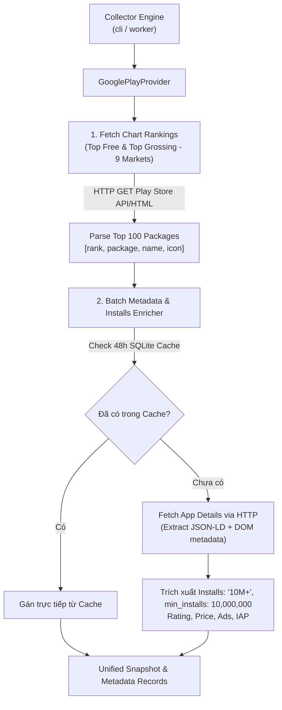

# Đặc Tả Kỹ Thuật 1: Google Play HTTP Scraper Engine (Android Data Acquisition)

- **Mã tài liệu:** `SPEC-AND-01`
- **Ngày tạo:** 2026-09-28
- **Trạng thái:** Approved
- **Tác giả:** NKhanh0908
- **Dự án:** Casual Scout — Multi-Platform Casual Games Market Research

---

## 1. Mục Tiêu & Bối Cảnh

### 1.1. Bối cảnh
Trước đây, module thu thập dữ liệu Android của Casual Scout sử dụng Selenium (Headless Chrome) để cào trang web Google Play. Cách tiếp cận này bộc lộ các nhược điểm nghiêm trọng:
1. **Ràng buộc môi trường:** Phụ thuộc vào việc cài đặt trình duyệt Chrome và ChromeDriver cục bộ.
2. **Hiệu năng thấp & ngốn tài nguyên:** Mỗi phiên cào khởi chạy một tiến trình Chrome tiêu tốn hàng trăm MB RAM và CPU, khiến thời gian thu thập kéo dài nhiều phút.
3. **Giới hạn số lượng:** Giao diện web Google Play qua DOM chỉ hiển thị 15-30 game ban đầu, không đáp ứng được chuẩn Top 100.
4. **Phạm vi hạn hẹp:** Bị gắn cứng (hardcoded) duy nhất thị trường Việt Nam (`gl=VN`, `hl=vi`), chưa hỗ trợ đa thị trường khu vực.
5. **Bỏ sót chỉ số quan trọng:** Chưa bóc tách trường **Lượt cài đặt (Installs)** - một lợi thế công khai độc quyền của Google Play so với App Store.

### 1.2. Mục tiêu
* Thay thế hoàn toàn Selenium/Chrome bằng **Google Play HTTP Scraper Engine** chuyên dụng ($0 budget, không cần mở trình duyệt, gửi HTTP request trực tiếp).
* Mở rộng phạm vi cào sang **9 thị trường trọng điểm** (đồng bộ chuẩn hóa với iOS): Việt Nam (`vn`), Thái Lan (`th`), Indonesia (`id`), Malaysia (`my`), Philippines (`ph`), Singapore (`sg`), Lào (`la`), Campuchia (`kh`), Hoa Kỳ (`us`).
* Thu thập đầy đủ **Top 100** cho cả 2 bảng xếp hạng: **Top Free** (`top-free`) và **Top Grossing** (`top-grossing`) trong danh mục Casual Games (`GAME_CASUAL`).
* Trích xuất chính xác trường **Lượt cài đặt (Installs / Min Installs)** cùng đầy đủ metadata app.
* Đảm bảo thời gian cào toàn bộ 9 thị trường hoàn tất trong vòng **dưới 60 giây**.

---

## 2. Kiến Trúc Bộ Thu Thập (Provider Architecture)

### 2.1. Thư viện & Giao thức HTTP ($0 Chi phí)
* Sử dụng thư viện chuẩn `google-play-scraper` (hoặc module HTTP client `httpx` với parser Google Play endpoints).
* Phương thức: HTTP GET công khai, giả lập headers tiêu chuẩn trình duyệt, không yêu cầu API key, không yêu cầu xác thực tài khoản Google.
* Chi phí: **$0.00**.

### 2.2. Danh sách 9 Thị trường & Mã Ngôn ngữ / Quốc gia tương ứng

| Mã Thị trường | Quốc gia | `gl` (Country) | `hl` (Language) | Nhóm |
| :--- | :--- | :--- | :--- | :--- |
| `vn` | Việt Nam | `VN` | `vi` | ASEAN Core |
| `th` | Thái Lan | `TH` | `th` | ASEAN |
| `id` | Indonesia | `ID` | `id` | ASEAN |
| `my` | Malaysia | `MY` | `en` | ASEAN |
| `ph` | Philippines | `PH` | `en` | ASEAN |
| `sg` | Singapore | `SG` | `en` | ASEAN |
| `la` | Lào | `LA` | `en` | ASEAN Lân cận |
| `kh` | Campuchia | `KH` | `en` | ASEAN Lân cận |
| `us` | Hoa Kỳ | `US` | `en` | Benchmark Quốc tế |

---

## 3. Đặc Tả Dữ Liệu Bóc Tách (Data Extraction Schema)

### 3.1. Dữ liệu Bảng xếp hạng (Chart Ranking)
Mỗi bản ghi trong bảng xếp hạng Top 100 bao gồm:
* `package` (`str`): Android Application ID (ví dụ: `com.king.candycrushsaga`).
* `rank` (`int`): Thứ hạng từ 1 đến 100.
* `name` (`str`): Tên hiển thị của game trên cửa hàng.
* `developer` (`str`): Tên studio/nhà phát triển niêm yết.
* `icon_url` (`str`): URL ảnh biểu tượng chất lượng cao.
* `store_url` (`str`): Đường dẫn trực tiếp đến trang Google Play Store.

### 3.2. Dữ liệu Metadata & Chỉ số Lượt tải (Enriched Metadata)
Mỗi game được bổ sung các trường thông tin:
* `installs` (`str`): Chuỗi văn bản hiển thị nguyên bản trên store (ví dụ: `"10,000,000+"`, `"50M+"`, `"500,000+"`).
* `min_installs` (`int`): Giá trị số nguyên tương ứng phục vụ lọc và so sánh định lượng (ví dụ: `10000000`, `50000000`, `500000`).
* `rating` (`float`): Điểm đánh giá trung bình từ người dùng (thang điểm 1.0 - 5.0).
* `rating_count` (`int`): Tổng số lượt người dùng đánh giá.
* `price` (`float`): Giá mua ứng dụng (0.0 cho game miễn phí).
* `currency` (`str`): Đơn vị tiền tệ niêm yết (VND, USD,...).
* `description` (`str`): Mô tả nội dung game đầy đủ (dùng cho Taxonomy Engine phân loại subgenre & mechanic).
* `has_ads` (`bool`): Game có chứa quảng cáo hay không.
* `has_iap` (`bool`): Game có tính năng mua vật phẩm trong ứng dụng (In-app purchases) hay không.
* `genres` (`list[str]`): Danh sách các nhãn thể loại do Google Play phân định (ví dụ: `["Casual", "Puzzle", "Single Player"]`).

---

## 4. Cơ Chế Xử Lý Lỗi, Giới Hạn Tần Suất & Retry Policy

1. **Timeout & Concurrency:**
   - Mỗi HTTP request có timeout tối đa 15 giây.
   - Sử dụng connection pooling qua `httpx.Client` hoặc batching 10 app đồng thời để tránh làm nghẽn kết nối và không bị Google rate limit.
2. **Exponential Backoff:**
   - Khi gặp mã lỗi HTTP `429 (Too Many Requests)` hoặc lỗi mạng tạm thời, hệ thống tự động retry tối đa 3 lần với thời gian chờ cấp số nhân (1s, 2s, 4s).
3. **Graceful Degradation:**
   - Nếu một số ít app không tải được metadata do bị gỡ khỏi store, bảng xếp hạng thứ hạng (Rankings) vẫn được bảo toàn nguyên vẹn và metadata của app đó sẽ đánh dấu `status='partial'`.

---

## 5. Tiêu Chí Nghiệm Thu (Acceptance Criteria)

- [ ] Thu thập thành công Top 100 game cho 9 quốc gia theo dõi mà không cần cài đặt hoặc khởi chạy Google Chrome.
- [ ] Lấy được đầy đủ cả 2 feed: `top-free` và `top-grossing`.
- [ ] 100% các game có thông tin lượt cài đặt hiển thị (`installs`) và số nguyên tối thiểu (`min_installs`).
- [ ] Thời gian thu thập toàn bộ 9 thị trường hoàn tất dưới 60 giây khi mạng ổn định.
- [ ] Đạt 100% test coverage cho module `GooglePlayProvider` với mock HTTP responses.
