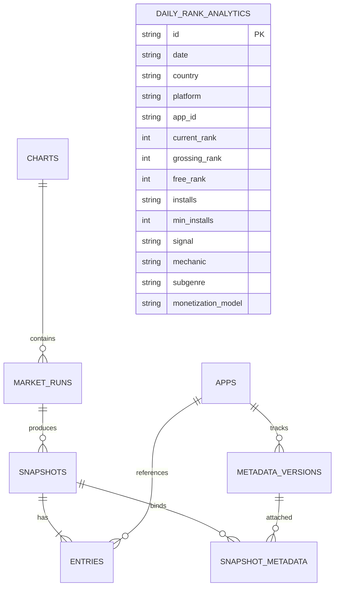

# Đặc Tả Kỹ Thuật 2: Tiến Hóa CSDL & Lưu Trữ Đa Nền Tảng (Storage & Schema Evolution)

- **Mã tài liệu:** `SPEC-AND-02`
- **Ngày tạo:** 2026-09-28
- **Trạng thái:** Approved
- **Tác giả:** NKhanh0908
- **Dự án:** Casual Scout — Multi-Platform Casual Games Market Research

---

## 1. Mục Tiêu & Nguyên Tắc Thiết Kế

### 1.1. Mục tiêu
* Tích hợp dữ liệu Android trực tiếp vào hệ thống cơ sở dữ liệu SQLite cốt lõi của Casual Scout thay vì lưu rời rạc ở bảng phụ riêng lẻ.
* Bổ sung trường dữ liệu lưu trữ **Lượt tải cài đặt (Installs / Min Installs)** cho Android, đồng thời giữ nguyên vẹn khả năng tương thích ngược 100% với dữ liệu iOS hiện có.
* Triển khai cơ chế **Smart Cache 48h** giúp hạn chế tối đa việc tải lại metadata trùng lặp của các game quen thuộc.

### 1.2. Nguyên tắc thiết kế
1. **Bất biến (Immutability):** Snapshot bảng xếp hạng khi đã ghi nhận là cố định vĩnh viễn, được kiểm chứng bằng mã SHA-256 payload.
2. **Không phá vỡ cấu trúc (Non-destructive Migration):** Toàn bộ các câu lệnh cập nhật schema đều dùng `ALTER TABLE ADD COLUMN` có điều kiện kiểm tra (idempotent), không làm mất hoặc sai lệch bất kỳ bản ghi iOS nào.
3. **Thống nhất định danh (Unified App Identity):**
   * Định danh thống nhất qua bộ ba `(provider, platform, source_app_id)`:
     * iOS: `provider='apple'`, `platform='ios'`, `source_app_id='1582218735'`
     * Android: `provider='google'`, `platform='android'`, `source_app_id='com.king.candycrushsaga'`

---

## 2. Chi Tiết Tiến Hóa Schema SQLite



### 2.1. Cập nhật Bảng `metadata_versions`
Bổ sung các cột mới nhằm lưu trữ chỉ số cài đặt từ Google Play:

```sql
-- Migration idempotent trong Repository.initialize()
ALTER TABLE metadata_versions ADD COLUMN installs TEXT;
ALTER TABLE metadata_versions ADD COLUMN min_installs INTEGER;
```

* `installs`: Chuỗi văn bản hiển thị nguyên gốc (ví dụ: `"10M+"`, `"50M+"`, `"500K+"`). Đối với iOS sẽ là `NULL`.
* `min_installs`: Số nguyên tương ứng (ví dụ: `10000000`, `50000000`, `500000`). Đối với iOS sẽ là `NULL`.

### 2.2. Cập nhật Bảng `daily_rank_analytics`
Bổ sung trường `platform` để phân định báo cáo và phân tích giữa iOS và Android:

```sql
ALTER TABLE daily_rank_analytics ADD COLUMN platform TEXT NOT NULL DEFAULT 'ios';
ALTER TABLE daily_rank_analytics ADD COLUMN installs TEXT;
ALTER TABLE daily_rank_analytics ADD COLUMN min_installs INTEGER;

CREATE INDEX IF NOT EXISTS idx_analytics_date_platform_country 
ON daily_rank_analytics(date, platform, country);
```

### 2.3. Bảng `charts` và `apps`
* Đã có sẵn cột `platform TEXT NOT NULL` và `provider TEXT NOT NULL`.
* Khi thu thập Android, hệ thống lưu bản ghi:
  * `provider = 'google'`
  * `platform = 'android'`
  * `country`: 1 trong 9 mã quốc gia (`vn`, `th`, `id`, `my`, `ph`, `sg`, `la`, `kh`, `us`).
  * `collection`: `'top-free'` hoặc `'top-grossing'`.
  * `genre`: `'GAME_CASUAL'`.
  * `depth`: `100`.

---

## 3. Cơ Chế Smart Cache 48 Giờ

Để tối ưu hóa số lượng request và tăng tốc độ crawl:
1. **Kiểm tra Cache:** Trước khi gửi request tải metadata của danh sách 100 app, hệ thống truy vấn `metadata_versions` tìm các app đã có metadata hợp lệ trong vòng **48 giờ** gần nhất (`fetched_at >= now - 48h`) với cùng `platform='android'` và `country`.
2. **Gán trực tiếp (Direct Binding):** Các app đã có trong cache được tạo liên kết ngay vào bảng `snapshot_metadata` mà không cần gọi network.
3. **Thu thập bù (Missing Delta Only):** Hệ thống chỉ thực hiện gọi HTTP request cho danh sách app thực sự mới xuất hiện trong bảng xếp hạng.

---

## 4. Tương Quan Thứ Hạng & Phân Loại Kiếm Tiền (Monetization Engine)

Tương tự cơ chế đã áp dụng cho iOS ở Phase 3.5:
* **Liên kết chéo thứ hạng (Cross-Rank Linking):**
  * Trong cùng 1 ngày và thị trường, game có mặt ở cả bảng Free và Grossing sẽ ghi nhận đồng thời `free_rank` và `grossing_rank`.
* **Phân loại mô hình kiếm tiền trên Android:**
  * `PAID_PREMIUM`: Game có giá bán > 0.
  * `HYBRID`: Game miễn phí có cả Quảng cáo (`has_ads = True`) và Mua vật phẩm (`has_iap = True` hoặc nằm trong bảng Grossing).
  * `PURE_IAP`: Game miễn phí chỉ có IAP, không có quảng cáo.
  * `PURE_ADS`: Game miễn phí có quảng cáo, không có IAP và không vào Top Grossing.

---

## 5. Tiêu Chí Nghiệm Thu (Acceptance Criteria)

- [ ] Áp dụng migration tự động và idempotent vào SQLite, không làm gián đoạn hoặc xóa dữ liệu cũ.
- [ ] Bảng `metadata_versions` và `daily_rank_analytics` lưu trữ và truy vấn chính xác `installs` và `min_installs`.
- [ ] Smart Cache 48h hoạt động chính xác: không gửi HTTP request cho các app đã có cache hợp lệ.
- [ ] Dữ liệu iOS và Android được phân tách mạch lạc qua cờ `platform`, truy vấn nhanh chóng qua index.
- [ ] Toàn bộ bộ test kiểm thử SQLite hiện tại giữ nguyên tỷ lệ Pass 100%.
